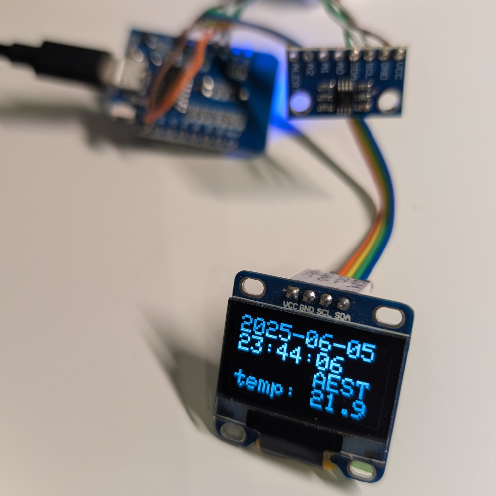

# esp_oled_time_temp

- ESP8266 D1 Mini
- MCP9808 Temperature Sensor
- SSD1306 OLED display
- NTP



## Building and Flashing

Build only

```
PLATFORMIO_BUILD_FLAGS="-DWIFI_SSID=some_wifi_ssid -DWIFI_PASS=some_wifi_password" \
  uv run pio run
```

Build and flash

```
PLATFORMIO_BUILD_FLAGS="-DWIFI_SSID=some_wifi_ssid -DWIFI_PASS=some_wifi_password" \
  uv run pio run --target upload -e d1_mini
```

Serial console (using screen; exit with `Ctrl-A \`)

```
screen /dev/ttyUSB0 115200
```
